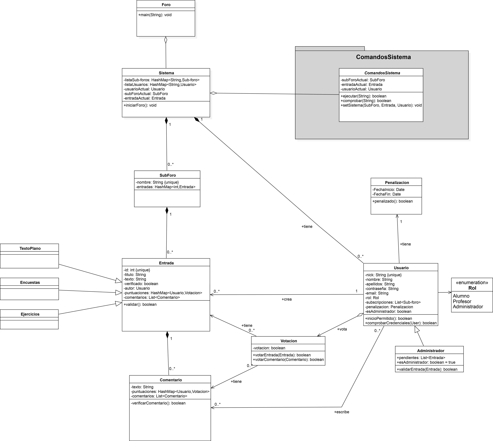

# Reddit-MP2020 Grupo4
Proyecto para desarrollar un programa en java de Foro que permita almacenar Entradas y Comentarios organizados en Sub-Foros para los alumnos y profesores de la Universidad Rey Juan Carlos. Asignatura de Metodología de la Programación - Ingeniería del Software - URJC 2020.

El sistema será una imitación de Reddit Inc. en el que los usuarios no registrados podrán leer las Entradas disponibles y los registrados podrán realizar comentarios y hacer votaciones sobre Entradas y Comentarios. Además, estos últimos podrán realizar subscripciones a distintos Sub-Foros, de los que recibirán notificaciones de las novedades cuando inicien sesión.

## Fase 1: Diseño

### Equipo de desarrollo

| Nombre	| Email	| Usuario GitHub |
|-------|-------|--------|
| Javier Espín Prieto	| j.espin.2017@alumnos.urjc.es	| jspindev |
| Jorge Utrero Sevillano	| j.utrero.2016@alumnos.urjc.es	| J-Utrero |
| Miguel Cendrero Ortega		| m.cendrero.2017@alumnos.urjc.es	| micenor |
| Óscar Rivas Melar         | o.rivas.2017@alumnos.urjc.es 	| oscar-llury |

### Diagrams

**Diagrama de clases Reddit-URJC**

**Diagrma de clases del paquete ComandosSistema**
-Reddit-G4.png)

Diagramas desarrollados con [StarUML](http://staruml.io/), el archivo se adjunta en [src/UMLclassesDiagram-Reddit-G4.mdj](src/UMLclassesDiagram-Reddit-G4.mdj).

## Fase 2: Implementación

## Fase 3: Test
