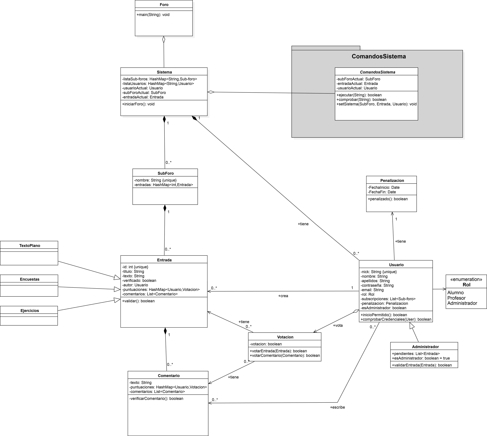

# Reddit-MP2020 Grupo4
Proyecto para desarrollar un programa en java de Foro que permita almacenar Entradas y Comentarios organizados en Sub-Foros para los alumnos y profesores de la Universidad Rey Juan Carlos. Asignatura de Metodología de la Programación - Ingeniería del Software - URJC 2020.

El sistema será una imitación de Reddit Inc. en el que los usuarios no registrados podrán leer las Entradas disponibles y los registrados podrán realizar comentarios y hacer votaciones sobre Entradas y Comentarios. Además, estos últimos podrán realizar subscripciones a distintos Sub-Foros, de los que recibirán notificaciones de las novedades cuando inicien sesión.

## Equipo de desarrollo

| Nombre	| Email	| Usuario GitHub |
|-------|-------|--------|
| Javier Espín Prieto	| j.espin.2017@alumnos.urjc.es	| jspindev |
| Jorge Utrero Sevillano	| j.utrero.2016@alumnos.urjc.es	| J-Utrero |
| Miguel Cendrero Ortega		| m.cendrero.2017@alumnos.urjc.es	| micenor |
| Óscar Rivas Melar         | o.rivas.2017@alumnos.urjc.es 	| oscar-llury |

## Fase 1: Diseño

Durante esta fase se ha desarrollado el diseño de la arquitectura del sistema Reddit-URJC.

### Diagramas de clases

**Diagrama de clases Reddit-URJC**

**Diagrama de clases del paquete ComandosSistema**
-Reddit-G4.png)

Diagramas desarrollados con [StarUML](http://staruml.io/), el archivo se adjunta en [src/UMLclassesDiagram-Reddit-G4.mdj](diagramas-UML/UMLclassesDiagram-Reddit-G4.mdj).

## Fase 2: Implementación

Durante esta fase se ha implementado el sistema en lenguaje Java con el IDE [Netbeans](https://netbeans.org/).
La clase de ejecución es Sistema, que se encarga de ejecutar un demostrador para el sistema. La estructura creada para el Foro es la siguiente:

    SubForo 1  
    |    Entrada 1  
    |    |    esto es el texto del Texto Plano.  
    |    |    esto es un ejercicio  
    |    |    Comentario 1  
    |    |    |    Comentario 1  
    |    |    Comentario 2  
    |    Entrada 2  
    |    |    esto es una encuesta  
    |    |    |    opcion 1: texto de la opción 1  
    |    |    |    opcion 2: texto de la opción 2  
    SubForo 2  
    |    Entrada 1  
    |    |    esto es el texto del Texto Plano.  

Si se quiere consultar como deben introducirse los comandos consultar el archivo [CommandsInput.md]().

### Escalabilidad

El sistema no permite la interacción real con un usuario mediante la salida y entrada de datos por línea de comandos. En caso de querer ampliar el proyecto y permitir dicha interacción, se debe sustituir al completo la clase *Sistema*. No es necesario realizar ninguna otra modificación en el resto de archivos, ya que estos ya han sido preparados para la interacción con un usuario real y tienen su control de errores respectivamente.  
En caso de querer extender el sistema añadiendo nuevos comandos que permitan realizar nuevas acciones sobre los datos del sistema, estos deben colocarse en la carpeta *ComandosSistema* y derivar de la clase abstracta *ComandosSistema.java*. Posteriormente, es suficiente con implementar de la forma deseada los métodos que se indican en la clase abstracta.  
De igual forma, en caso de querer añadir nuevos tipos de entradas, el nuevo fichero debe colocarse en el paquete *Entradas* y derivar de la interfaz *TipoEntrada.java*. Posteriormente, es suficiente con implementar los métodos indicados y añadir como propiedad privada la estructura de datos que almacenará los datos de dicho nuevo tipo de entrada.

## Fase 3: Test
